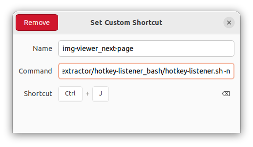
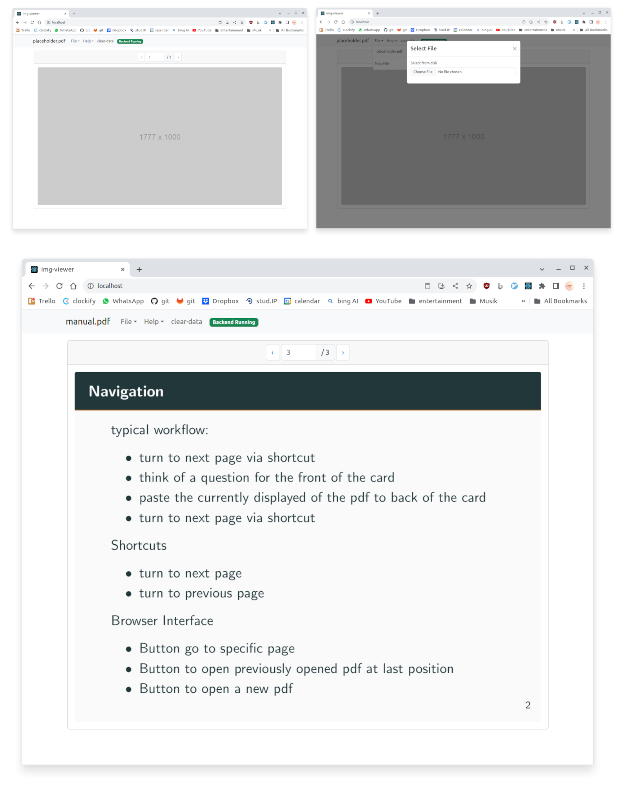

# Image Extractor

The program copies a previewed page of a given pdf document to the systems clipboard. Since it runs in the background the pages can be turned using hotkeys or by clicking in the preview window. 

This program will be useful when working with ankidroid so that you don't have to screenshot each page you want to make a flashcard for. Just move to the page in the preview window and the page can be pasted directly.

## Usage: 

### Main Application
The application is packaged into a front- and a backend docker image. To startup both, use the attributed [docker-compose](./docker-compose.yml) file.

```bash
# startup containers
docker-compose up -d

# shutdown containers
docker-compose down -v

# rebuild images
docker-compose build
```

Docker images available on dockerhub ([frontend](https://hub.docker.com/repository/docker/dermacon/img-viewer_frontend/general), [backend](https://hub.docker.com/repository/docker/dermacon/img-viewer_backend/general))

### Hotkeys
To configure the shortcuts use [this](./hotkey-listener_bash/hotkey-listener.sh) script. In Ubuntu a configuration might look like this:




## UI



## Example:


## Technology Stack
- Python3, Flask
- React.js, socket.IO

## Dev Commands
```
cd src/
flask --app main.py run --reload --debug
```

in another terminal
```
cd frontend/
npm start
```

or spin up the the docker containers
```
docker-compose build
docker-compose up -d
```

python venv commands
```
pipreqs .
python3 -m venv env
source env/bin/activate
pip3 install -r requirements.txt
```
