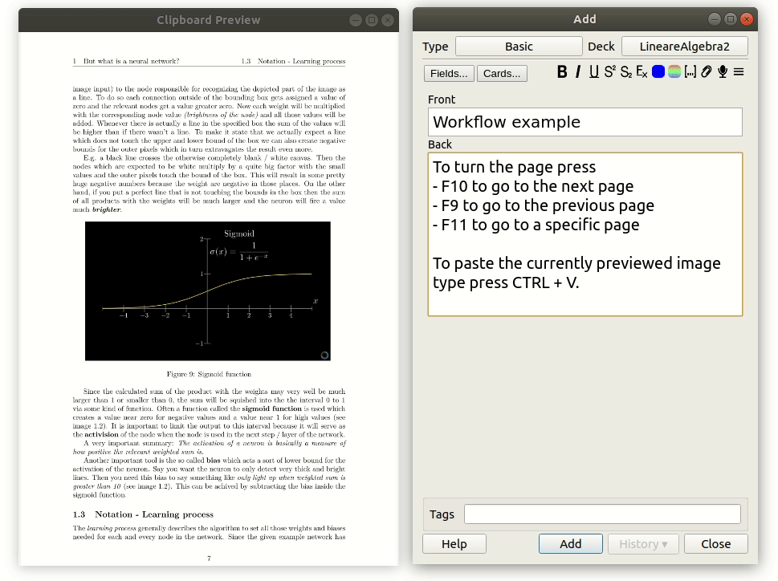

# Image Extractor

## UI


The program copies a previewed page of a given pdf document to the systems clipboard. Since it runs in the background the pages can be turned using hotkeys or by clicking in the preview window. 

This program will be useful when working with ankidroid so that you don't have to screenshot each page you want to make a flashcard for. Just move to the page in the preview window and the page can be pasted directly.

## Usage: 
* `f9`: go to previous page
* `f10`: go to previous page
* `f11` + number + `Enter`: go to specified page number

## Example:


## Credits
* Image to clipboard: http://omtlab.com/java-store-image-in-clipboard/
* JNativeHook Framework - system wide shortcut hook: https://github.com/kwhat/jnativehook/releases
* Resize image: https://deano.me/2012/02/java-resize-an-image-keeping-the-proportions-correct/
* Pdf box Framework - Apache: https://pdfbox.apache.org/

## todo
* jar can't append new pdf file 
* worker thread sometimes throws exception when canceling queue


## Run New Version
```
cd src/
flask --app main.py run --reload --debug
```

in another terminal
```
cd frontend/
npm start
```

